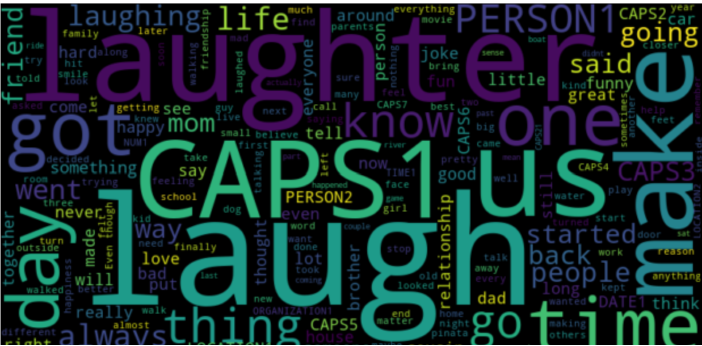

<h1 align="center">English Quality Prediction Project</h1>


## Overview
<p align="justify">
This project aims to predict the quality of English essays using a dataset containing over 7000 carefully graded essays. It involves thorough data cleaning and exploratory data analysis to create effective features. The main goal is to develop a sophisticated Natural Language Processing (NLP) solution, essential for Easy Sailing Language Training's English program. The objective is to build a tool aligned with the IELTS grading system, assisting new students in assessing their English writing proficiency and estimating the time required to advance to higher proficiency levels.
</p>

## Project Scope

### Problem Statement
The project aims to construct an end-to-end pipeline capable of processing essays and assigning a grade that effectively communicates the level of English proficiency. Exploring additional libraries such as Spacy, NLTK, scikit-learn.
### Reframing Options
In the event of challenges arising during dataset analysis, there is the option to reframe the problem as a classification task (e.g., poor, average, great).

## Project Objectives

1. **Data Exploration:**
   - Conduct thorough exploratory data analysis (EDA) to gain a comprehensive understanding of the dataset.
   - Address challenges related to data cleaning and preprocessing.

2. **Feature Engineering and Selection:**
   - Engineer pertinent features that significantly contribute to the model's predictive capability.
   - Thoughtfully select features that enhance overall model performance.

3. **Model Training and Evaluation:**
   - Train a model using the provided dataset to predict essay ratings.
   - Evaluate the model's performance using relevant metrics.


## Contributors

- [Keneth](https://github.com/kenneth6370)
- [Pascal Dissivouloud](https://github.com/Pascal-Dissi)
- [Horlain](https://github.com/Horlain)
- [Denis-SOH](https://github.com/Denis-SOH)
- [Aurelie](https://github.com/AurerlieMassop)

## Libraries Used (Python 3.11.8)

- imblearn==0.0
- matplotlib==3.8.3
- neattext==0.1.3
- numpy==1.26.4
- nltk==3.8.1
- pandas==2.2.1
- scikit-learn==1.2.2
- scipy==1.12.0
- xgboost==2.0.3

## Install the required dependencies::
   ```bash
   pip install -r requirements.txt


